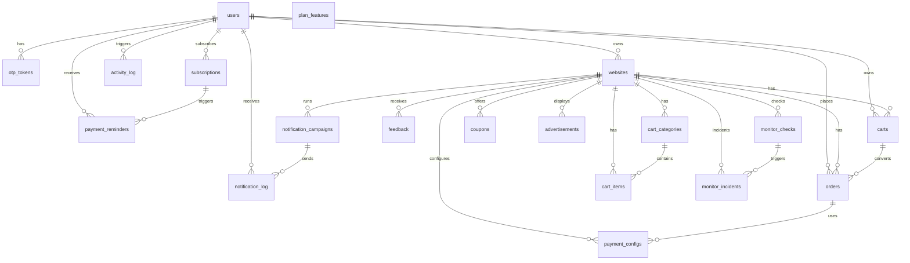

# Full Object Relationship Model (ERM)

```mermaid
erDiagram
    users ||--o{ otp_tokens : has
    users ||--o{ subscriptions : subscribes
    users ||--o{ payment_reminders : receives
    users ||--o{ notification_log : receives
    users ||--o{ activity_log : triggers
    users ||--o{ websites : owns
    users ||--o{ carts : owns
    users ||--o{ orders : places
    websites ||--o{ cart_categories : has
    websites ||--o{ cart_items : has
    websites ||--o{ carts : has
    websites ||--o{ orders : has
    websites ||--o{ payment_configs : configures
    websites ||--o{ feedback : receives
    websites ||--o{ monitor_checks : checks
    websites ||--o{ monitor_incidents : incidents
    websites ||--o{ coupons : offers
    websites ||--o{ advertisements : displays
    websites ||--o{ notification_campaigns : runs
    cart_categories ||--o{ cart_items : contains
    carts ||--o{ orders : converts
    orders ||--o{ payment_configs : uses
    subscriptions ||--o{ payment_reminders : triggers
    monitor_checks ||--o{ monitor_incidents : triggers
    notification_campaigns ||--o{ notification_log : sends
    plan_features
```
